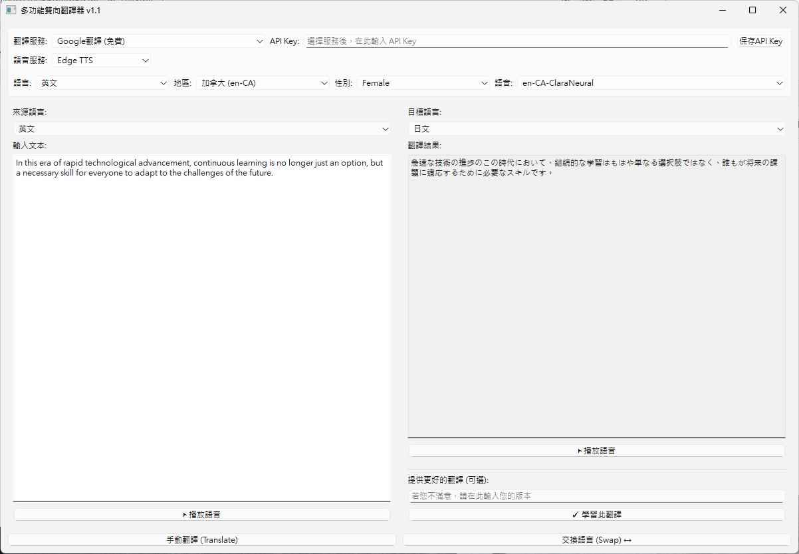

# 多功能雙向翻譯器 (Multi-functional Bidirectional Translator)

這是一個使用 Python 和 PyQt6 開發的桌面應用程式，旨在提供一個整合多種翻譯服務和文字轉語音 (TTS) 引擎的強大工具。使用者可以輕鬆進行即時雙向翻譯、比較不同引擎的結果，並聆聽清晰的語音朗讀。



## 主要功能

- **多引擎翻譯**:
  - **免費服務**: Google 翻譯、Groq (Llama3 模型)、Bing 翻譯。
  - **付費 API**: 支援 Google Gemini Pro 和 DeepL API，提供更高品質的翻譯。
- **多引擎語音合成 (TTS)**:
  - **Microsoft Edge TTS**: 提供高品質、自然的線上語音合成。
  - **Google TTS**: 經典的 gTTS 服務。
  - **系統原生 TTS**: 使用 `pyttsx3` 調用您操作系統內建的語音引擎（可離線使用）。
- **動態語音選擇**:
  - 自動從線上服務拉取 Edge TTS 的所有可用語音，並按「語言 -> 地區 -> 性別」進行階層式分類。
  - 自動偵測並列出系統上所有已安裝的 TTS 語音。
- **AI 翻譯優化**:
  - 獨特的「學習此翻譯」功能，允許您提供偏好的翻譯範例。
  - 這些範例會被用來指導大型語言模型 (如 Llama3)，使其翻譯結果更符合您的個人風格和語氣。
- **高效的使用者介面**:
  - **即時雙向翻譯**: 可隨時點擊「交換語言」按鈕，對調來源與目標語言，並在新的輸入框繼續編輯。
  - **自動翻譯**: 在您停止輸入後，程式會自動進行翻譯，無需手動點擊。
  - **API Key 管理**: 內建安全的 API Key 管理介面，您的金鑰會被儲存在本機設定中。
- **穩健的架構**:
  - 應用程式啟動時，會在背景非同步載入線上語音列表，確保介面流暢不卡頓。
  - 採用穩定的同步阻塞方式處理語音播放，最大限度地提高在不同系統環境下的兼容性。
  - 自動化管理臨時生成的語音檔案，程式關閉時會自動清理。

## 環境需求

- Python 3.8 或更高版本
- 經過 Windows 10/11 測試，理論上支援 macOS 和 Linux (需確保 PyQt6 和相關依賴正確安裝)。

## 安裝與設定

1.  **克隆或下載專案**
    ```bash
    git clone [https://github.com/your-username/your-repository-name.git](https://github.com/your-username/your-repository-name.git)
    cd your-repository-name
    ```

2.  **建立並啟用虛擬環境 (強烈推薦)**
    ```bash
    # Windows
    python -m venv venv
    .\venv\Scripts\activate

    # macOS / Linux
    python3 -m venv venv
    source venv/bin/activate
    ```

3.  **安裝所有依賴項目**
    ```bash
    pip install -r requirements.txt
    ```

4.  **運行應用程式**
    ```bash
    python main.py
    ```

## 使用說明

1.  **選擇服務**: 從頂部的「翻譯服務」和「語音服務」下拉選單中選擇您想使用的引擎。
2.  **設定 API Key**:
    - 如果您選擇了付費服務 (如 Gemini Pro, DeepL)，請在「API Key」輸入框中貼上您的金鑰。
    - 點擊「保存API Key」按鈕。金鑰會被安全地保存在本機，下次啟動時會自動載入。
3.  **開始翻譯**:
    - 在左側的「輸入文本」框中輸入或貼上文字。
    - 程式會在您停止輸入約 1.2 秒後自動翻譯。您也可以點擊「手動翻譯」按鈕立即翻譯。
4.  **播放語音**: 點擊任一側文本框下方的「▶ 播放語音」按鈕來朗讀文字。
5.  **優化 AI 翻譯**:
    - 當使用 Llama3 翻譯後，如果您覺得結果不夠理想，可以在右下方的「提供更好的翻譯」框中輸入您的版本。
    - 點擊「✓ 學習此翻譯」按鈕，這個範例就會被儲存起來，用於指導未來的翻譯。

## 授權條款

本專案採用 [MIT 授權條款](LICENSE)。
*(提示: 建議您在專案中也建立一個名為 `LICENSE` 的檔案，並將 MIT 授權條款的內容貼入)*
